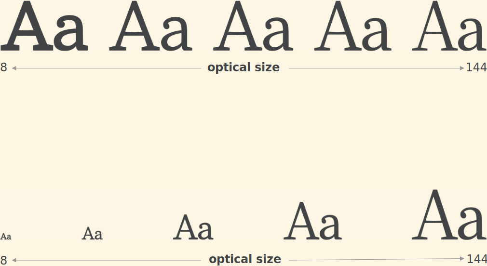

<h4 class="headline first-letter">Amstelvar</h4>

<aside class="notes">
  <ul>
    <li>Weitere Achse</li>
      <li>Begriff Optische Größe</li>
      <li>Im Bleisatz selbstverständlich untersch. Schriftgrößen unterschiedlich zu gestalten</li>
      <li>Mit Einführung Fotosatz digitalisierung der Typografie</li>
      <li>Skalierung der Schriften möglich</li>
      <li>kleine schriften zu mager und große Schriften zu plump</li>
      <li>Untersch. Schriften verschiedene opt. Größen die ab bestimmter Punktgröße angewandt wird</li>
      <li>Kann nun auch interpoliert werden</li>
  </ul>
</aside>
