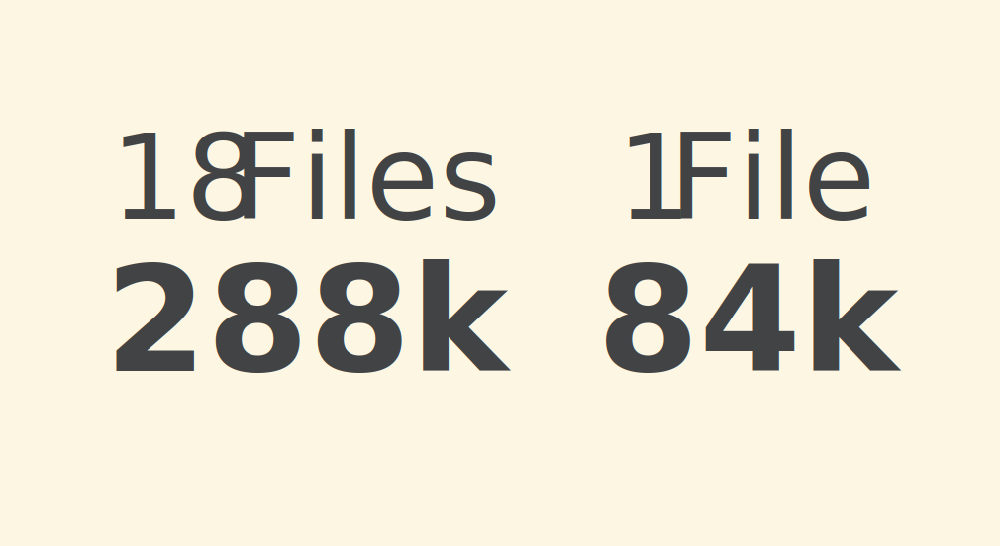

<h4 class="headline first-letter">FF Meta Variable</h4>

<aside class="notes">
  <ul>
   <li>­Datenmengen einsparen</li>
   <li>Variable FF Meta als Beispiel</li>
   <li>abbid der FF Meta</li>
   <li>18 Einzelschnitte auf 1 FILE MIT 84k runtergebrochen</li>
   <li>D.H.  1 File alle 18 Einzelschnitte abbilden</li>
   <li>Reihe neue Möglichkeit</li>
   <li>Aus Performance perspektive 3-4 Schriftarten</li>
   <li>Besonders interessant für webdesign und experience einer seite</li>
  </ul>
</aside>
